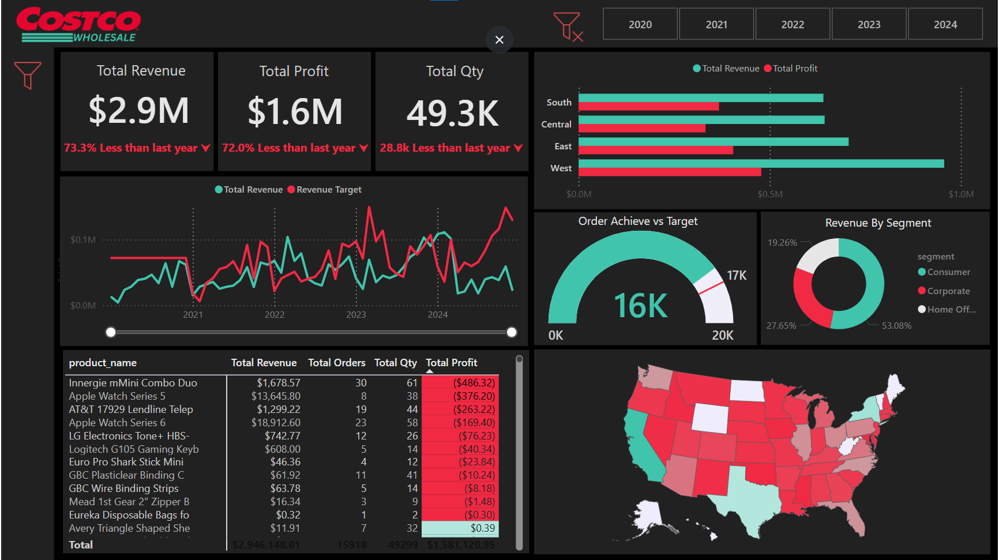
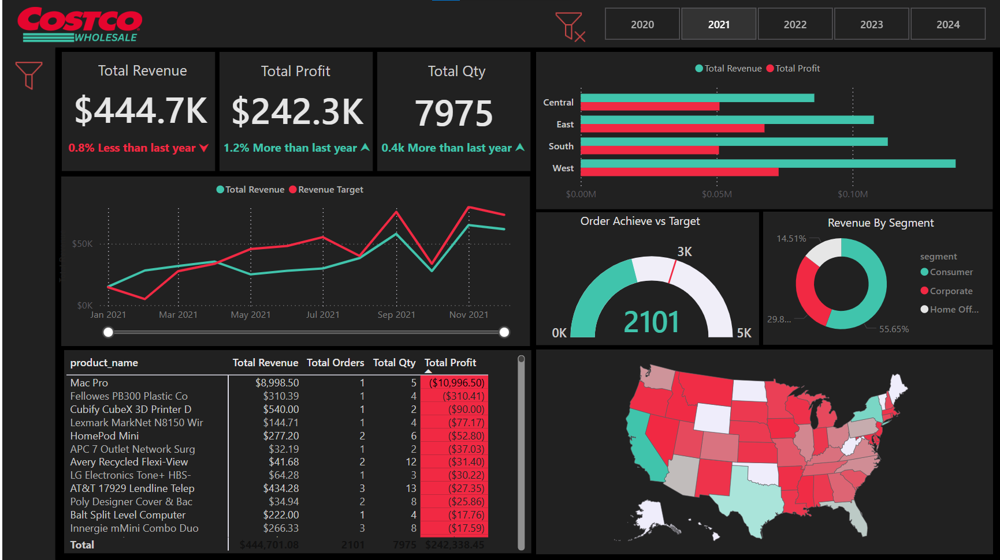
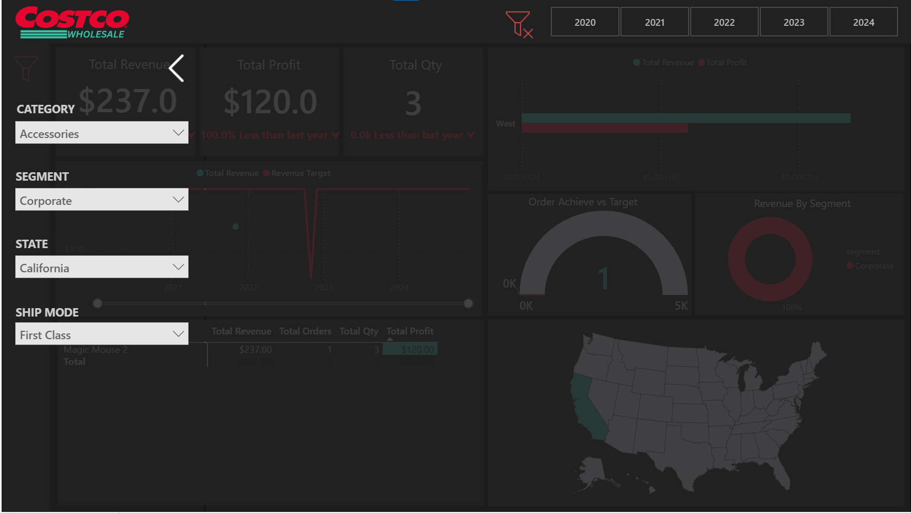

# Costco Sales [Dashboard](https://app.powerbi.com/view?r=eyJrIjoiYzFjOWYyZGItNWRlZC00ZWJmLTg0YmItNDg0YjlmY2Q4MjQ2IiwidCI6ImY5ODg0Yzc0LTBhNTUtNDA0OC05ZTQxLWFjMzY1YTg1OWMyYyJ9)

## 📊 Project Overview

This project analyzes five years of Costco sales data (2020-2024) to uncover actionable insights, such as top-performing products, category-wise profitability, and regional success. A real-time dashboard was created using Power BI to help Costco's management make informed decisions and track business performance effectively.

---

## 🎯 Objective

Analyze Costco’s sales data to identify trends, assess profitability, and evaluate performance across regions. Deliver a user-friendly Power BI dashboard to visualize these insights in real-time.

---

## 🚀 Key Features

- **Integration of Diverse Data Sources**: PostgreSQL, MySQL, Excel, CSV, and PDF.
- **Currency Standardization**: Used USD conversion for consistent reporting across countries.
- **Profitability Analysis**: Incorporated COGS, discounts, and quantities for detailed insights.
- **Interactive Dashboards**: Included slicers, custom panes, and drillthrough buttons for detailed analysis.
- **Advanced DAX Calculations**: Created KPIs such as revenue, profit margin, and YoY sales growth.

🔗 [View the Dashboard Here](https://app.powerbi.com/view?r=eyJrIjoiYzFjOWYyZGItNWRlZC00ZWJmLTg0YmItNDg0YjlmY2Q4MjQ2IiwidCI6ImY5ODg0Yzc0LTBhNTUtNDA0OC05ZTQxLWFjMzY1YTg1OWMyYyJ9)

---

## 🛠 Tools & Technologies

- **Power BI**: For data cleaning, modeling, and visualization.
- **Python & Pandas**: For exploratory data analysis (EDA) and initial cleaning.
- **Datasets Used**:
  - **Customer Dataset** (PostgreSQL): Customer details.
  - **Yearly Sales Dataset** (4 CSV files): Sales data from 2020-2024.
  - **Product Dataset** (Excel): Product details, including unit price and cost of goods sold (COGS).

---

## 🔍 Process

### 1️⃣ Exploratory Data Analysis (EDA)

- Conducted EDA using Python and Pandas to understand data patterns.
- Identified inconsistencies, such as extra spaces and non-uniform column names.

### 2️⃣ Data Integration and Cleaning

- **Connected to Multiple Data Sources**: Integrated PostgreSQL, Excel, and CSV files.
- **Used Power Query**: Performed data cleaning, transformation, and merging for seamless integration.
- **Handled Missing Data**: Removed rows with null values in critical fields (e.g., unit price, quantity).
- **Resolved Duplicates**: Ensured data integrity by addressing duplicate records.
- Ensured consistent units for analysis by normalizing data metrics.

### 3️⃣ Data Modeling

- **Established Relationships**: Built relationships between tables for unified modeling (star schema).
- **Merged Data**: Combined COGS and product data using Power Query to calculate profits.
- **Incorporated Discounts**: Factored in discount percentages and quantities for precise metrics.

### ️4️⃣ Dashboard Design

- **Intuitive Layout**: Organized visuals into logical sections, allowing quick navigation and clarity.
- **Dynamic Filters**: Included slicers for year, region, and product category to enable flexible analysis.
- **Key Performance Indicators (KPIs)**: Displayed metrics like total revenue, profit margin, and YoY growth prominently for instant insights.
- **Interactive Charts**: Added bar charts, line graphs, and pie charts to highlight trends and patterns effectively.
- **Drillthrough Options**: Implemented drillthrough buttons for detailed exploration of specific products or regions.
- **Custom Tooltips**: Designed tooltips for charts to provide additional context and data points upon hover.
- **Color-Coded Metrics**: Used a consistent color scheme to differentiate between profit, loss, and other critical indicators.

### 5️⃣ Advanced Calculations

- Developed multiple DAX measures: Revenue, profit, and profit margin.
- Target sales based on last month's performance.
- YoY growth and sales trends.

---

## 💡 Skills Demonstrated

- **Critical Thinking**: Addressed data quality issues effectively.
- **Data Modeling**: Established robust dataset relationships in Power BI.
- **Time Management**: Delivered a functional dashboard within deadlines.
- **Technical Proficiency**: Combined Python’s EDA capabilities with Power BI’s visualization tools.
- **Project Planning**: Successfully managed the project from data acquisition to dashboard delivery.

---

## 📈 Business Impact

This dashboard enables Costco’s management to:

- Monitor performance metrics in real-time.
- Identify profitable and underperforming areas.
- Make data-driven decisions to optimize operations and improve profitability.

---

## 🔗 Explore the Project

[View the Dashboard](https://app.powerbi.com/view?r=eyJrIjoiYzFjOWYyZGItNWRlZC00ZWJmLTg0YmItNDg0YjlmY2Q4MjQ2IiwidCI6ImY5ODg0Yzc0LTBhNTUtNDA0OC05ZTQxLWFjMzY1YTg1OWMyYyJ9)

Feel free to explore and reach out with any questions or feedback!

---

## 🔗 Report Screenshots

### **Sales Overview Dashboard**  
  

### **2021 Sales Overview Dashboard**  
  

### **Sales Overview Dashboard with Filters applied**  
  

Feel free to explore and reach out with any questions or feedback!

